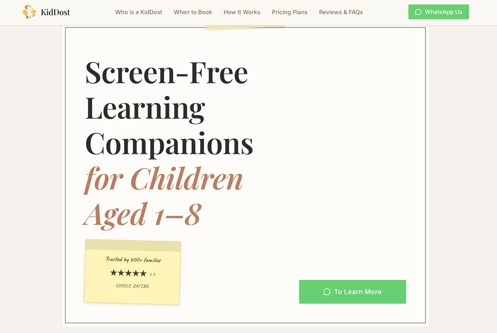
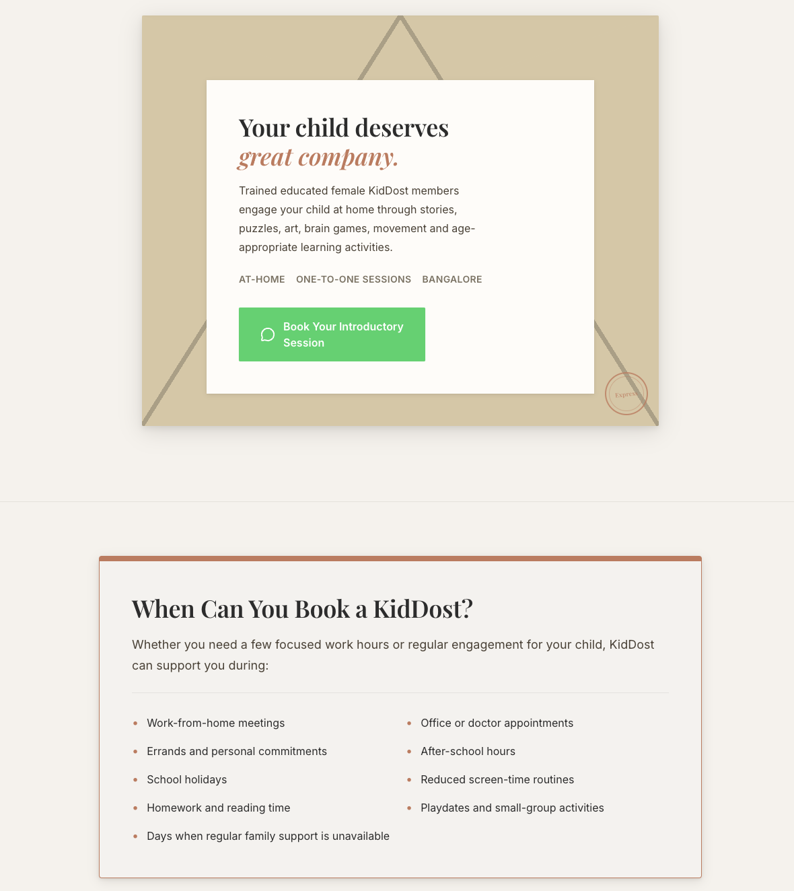
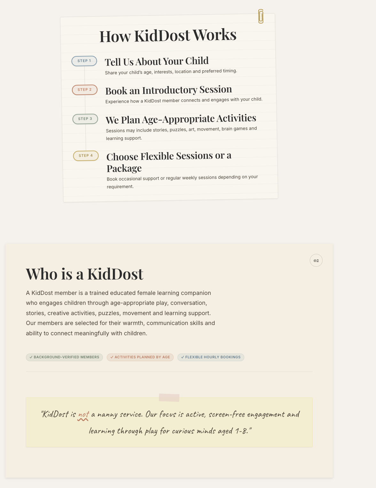
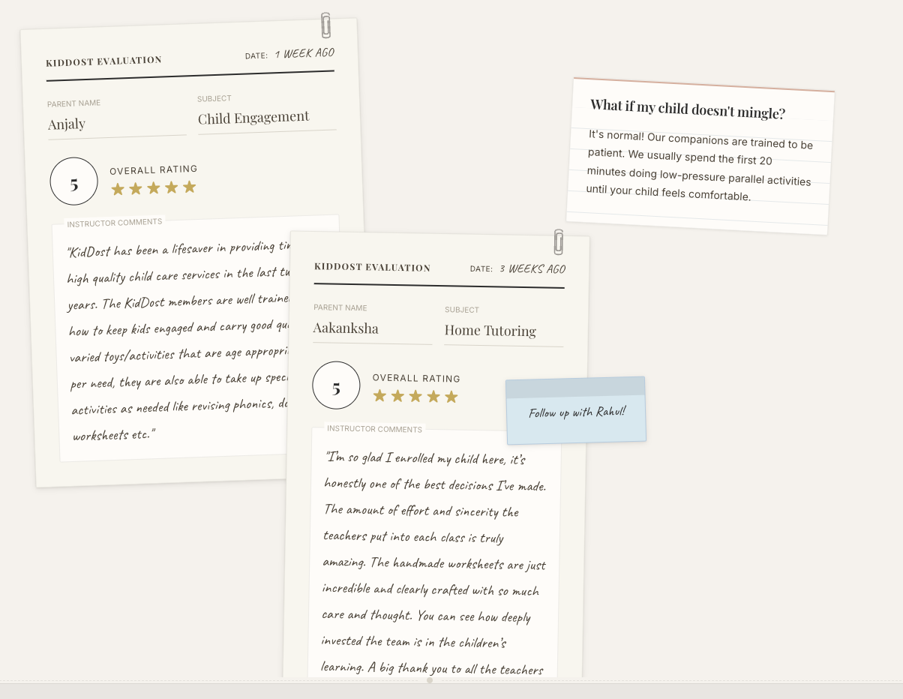

# KidDost website!

**Live Website:** [www.kiddost.com](https://www.kiddost.com)

KidDost is a professional web application built to serve as the digital storefront for my mother's childcare buisness!

This project was developed as a complete modernization and migration from an older, limited Wix website into a fully custom, high-performance web application built with modern web technologies which looks a LOT better.

## The Design Theme

A primary focus of this project was crafting a highly unique and engaging visual aesthetic. The website utilizes a **skeuomorphic, physical stationery theme it makes you feel like you're back in the classroom doing projects and craft!**. 

Rather than relying on flat, generic web layouts, the interface mimics real-world objects:
- Warm paper textures and kraft backgrounds
- Physical envelopes, notebook clips, and report cards
- Decorative elements like masking tape, rubber stamps, and folded corners
- A combination of serif typography for headings and handwritten fonts for annotations

This design language creates a warm, premium, and trustworthy atmosphere that aligns perfectly with a child-care and learning companionship service.

## My Learning Journey

Building this was a REALLY fun experience that significantly advanced my skills in front end development and design!

Throughout the development process, I learned:
- **Advanced UI/UX Design:** Translating physical world concepts into digital components using CSS and understanding how to maintain a consistent aesthetic language across an entire application.
- **Component Architecture:** Structuring complex, reusable React components to handle specialized visual layouts (like certificates and catalogue pages).
- **Styling Libraries:** Mastering utility-first CSS frameworks to build intricate layouts, manage responsive design, and implement custom color palettes and typography.
- **Animation and Interactivity:** Using animation libraries to bring physical elements to life (e.g., paper sliding, tape peeling, and floating buttons) without compromising performance.
- **Modern Web Frameworks:** Navigating the ecosystem of modern React frameworks to build a production-ready, fast, and SEO-friendly application.

## Tech
- Next.js (React Framework)
- Tailwind CSS (Styling)
- Framer Motion (Animations)
- Lucide React (Icons)

## Images

  
  

  
  

